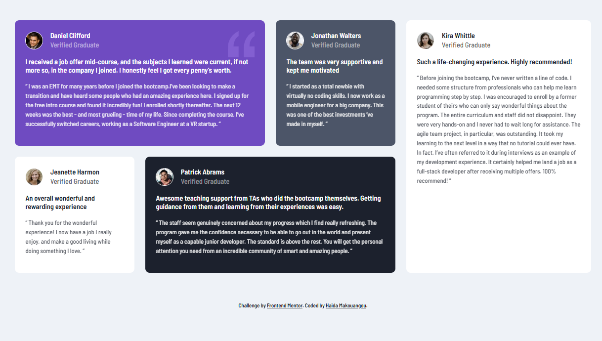

# Frontend Mentor - Testimonials Grid Section Solution

This is a solution to the [Testimonials Grid Section](https://www.frontendmentor.io/challenges/testimonials-grid-section-Nnw6J7Un7) challenge on Frontend Mentor. Frontend Mentor challenges help you improve your coding skills by building realistic projects.

## Table of Contents

- [Overview](#overview)
- [The Challenge](#the-challenge)
- [Screenshot](#screenshot)
- [My Process](#my-process)
- [Built With](#built-with)
- [What I Learned](#what-i-learned)
- [Continued Development](#continued-development)
- [Useful Resources](#useful-resources)

## Overview

### The Challenge
The task was to create a responsive testimonials grid section for a webpage using Bootstrap. The section includes several testimonials from verified graduates, displayed in individual cards with images, names, and quotes.

### Screenshot

## My Process

### Built With
- HTML
- CSS
- Bootstrap
- Google Fonts

### What I Learned
During this project, I deepened my understanding of using Bootstrap’s grid system to create a flexible, responsive layout. I also learned how to implement components like cards and image avatars to design an aesthetically pleasing testimonial section. Additionally, I worked on integrating custom CSS with Bootstrap’s utilities to refine the design.

### Continued Development
Moving forward, I plan to continue improving my Bootstrap knowledge, particularly in customizing components with utility classes and ensuring a pixel-perfect design. I would also like to explore more advanced Bootstrap features like modals and carousels for future projects.

## Useful Resources
- [Bootstrap Documentation](https://getbootstrap.com/)
- [Frontend Mentor Challenge](https://www.frontendmentor.io/challenges/testimonials-grid-section-Nnw6J7Un7)

